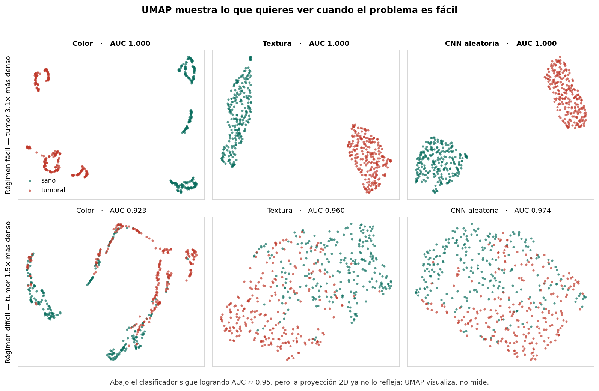
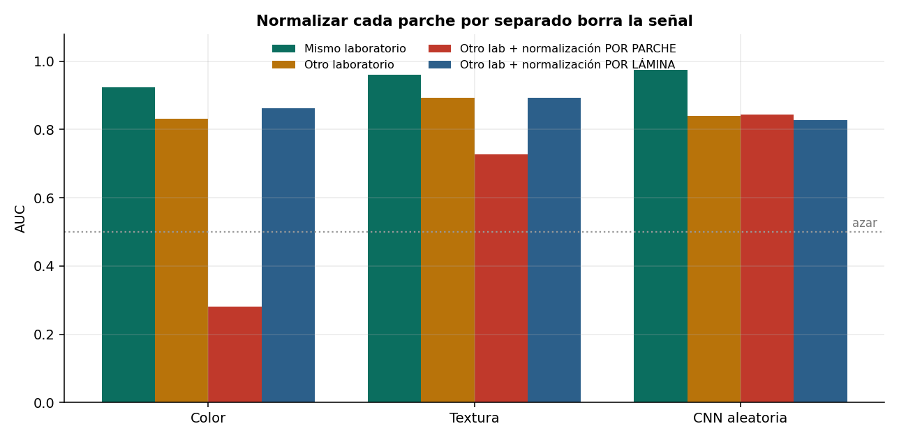
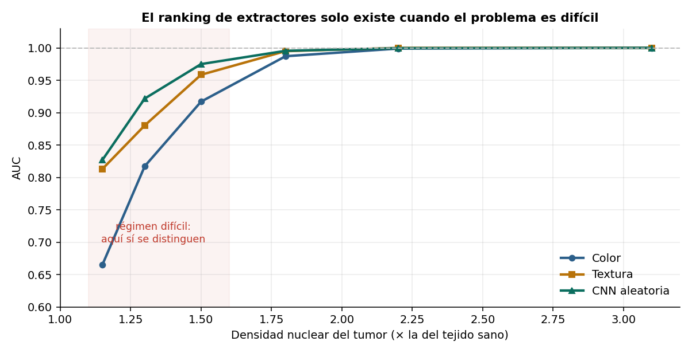

# Embeddings: el código de barras del tejido

Comparación medida de tres familias de extractores de características sobre parches de
histología, con énfasis en lo que de verdad determina si un modelo sirve: la
generalización entre laboratorios.



## Resultado principal

**Normalizar la tinción parche por parche destruye la señal.**

| Extractor | Sin normalizar | Normalización por **parche** | Normalización por **lámina** |
|---|---|---|---|
| Color | 0.8316 | **0.2817** | 0.8631 |
| Textura | 0.8926 | 0.7274 | 0.8940 |
| CNN aleatoria | 0.8393 | 0.8437 | 0.8275 |

Reinhard iguala media y desviación de cada imagen a una referencia. Pero la señal que
distingue tumor de sano *es* la densidad nuclear, y la densidad nuclear cambia la media de
color del parche: normalizar por parche borra exactamente lo que se quiere detectar. El
color cae a AUC 0.28, peor que el azar.

La forma correcta es estimar una sola transformación **por laminilla** y aplicarla igual a
todos sus parches.



## El ranking solo existe en el régimen difícil

| Densidad tumoral | Color | Textura | CNN aleatoria |
|---|---|---|---|
| 1.15x | 0.665 | 0.813 | **0.827** |
| 1.50x | 0.917 | 0.959 | **0.975** |
| 2.20x | 0.999 | 1.000 | 1.000 |
| 3.10x | 1.000 | 1.000 | 1.000 |



Con un contraste fuerte los tres extractores empatan en AUC 1.0 y la comparación no dice
nada. El punto de operación en el que se evalúe determina la conclusión.

Nota: la CNN aleatoria no está entrenada ni preentrenada — son convoluciones con pesos al
azar más ReLU y pooling estadístico. Que supere a descriptores diseñados a mano mide cuánto
aporta la arquitectura convolucional por sí sola.

## Generalización entre laboratorios

| Extractor | AUC lab A | AUC lab B | Caída |
|---|---|---|---|
| Color | 0.9234 | 0.8316 | −9.9% |
| Textura | 0.9602 | 0.8926 | **−7.0%** |
| CNN aleatoria | 0.9741 | 0.8393 | **−13.8%** |

La CNN aleatoria es la mejor dentro del mismo laboratorio y la que peor generaliza: más
capacidad de representación, más capacidad de sobreajustarse a la tinción.

Esta es la razón de que existan los modelos fundacionales de patología: UNI2-h se entrenó
sobre más de 200 millones de parches de unas 350,000 láminas de fuentes diversas, y esa
diversidad es lo que permite aprender representaciones robustas a la tinción.

## UMAP visualiza, no mide

En el régimen difícil la proyección 2D es un revoltijo mientras el clasificador logra AUC
de 0.92 a 0.97 sobre los mismos datos. UMAP preserva estructura local de vecindad, no
separabilidad global. Si publicas un UMAP, publica también el AUC.

## Contenido

```
notebooks/embeddings_wsi.ipynb    Notebook completo, ejecutable sin datos externos
src/sintetica.py                  Generador de tejido H&E
src/parches.py                    Conjuntos etiquetados con variación de tinción
src/extractores.py                Color, textura (LBP + Haralick), CNN aleatoria
src/normalizar.py                 Reinhard por parche y por lámina
src/extractores_profundos.py      ResNet50 y UNI2-h (requiere PyTorch)
figuras/                          Figuras generadas
```

## Reproducir

```bash
git clone https://github.com/USUARIO/wsi-embeddings.git
cd wsi-embeddings
pip install -r requirements.txt
jupyter lab notebooks/embeddings_wsi.ipynb
```

No requiere descargar datos ni pesos: todo se genera dentro del notebook.

## Extractores profundos

`src/extractores_profundos.py` incluye el código para ResNet50 (ImageNet) y UNI2-h.

**Sobre UNI2-h:** se distribuye bajo licencia CC-BY-NC-ND 4.0, únicamente para
investigación académica no comercial y con atribución. El acceso requiere registro previo
en Hugging Face con correo institucional, y al descargarlo se acepta no redistribuir los
pesos. **Este repositorio no los incluye.**

MahmoodLab publica también embeddings ya extraídos para TCGA, CPTAC y PANDA bajo la misma
licencia.

## Limitaciones

El tejido es sintético y la tarea es una sola (densidad nuclear). Arquitectura glandular,
invasión de bordes y patrón de crecimiento no están modelados.

La variación de tinción también es sintética: multiplicar canales RGB es una aproximación
cruda frente a la variación real, que afecta de forma no lineal a cada tinción por separado
— de ahí los métodos de deconvolución como Macenko y Vahadane.

La CNN aleatoria es un baseline para razonar, no una recomendación práctica.

No se midió robustez a magnificación, tan importante como la tinción en datos reales.

## Referencias

- Chen R.J. et al. *Towards a general-purpose foundation model for computational pathology.* Nature Medicine, 2024.
- Reinhard E. et al. *Color transfer between images.* IEEE Computer Graphics and Applications, 2001.
- Macenko M. et al. *A method for normalizing histology slides for quantitative analysis.* ISBI, 2009.
- McInnes L., Healy J., Melville J. *UMAP: Uniform Manifold Approximation and Projection.* arXiv:1802.03426, 2018.

## Licencia

MIT (el código de este repositorio) — ver [LICENSE](LICENSE).
